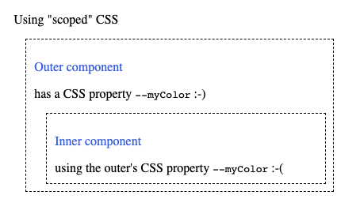

# Astro scoped CSS and define:vars leakage

Illustration of how it works currently


The CSS custom property <code>--myColor</code> is defined in the scope of the <code>&lt;Outer></code> components' class name, which Astro generates, like:

```css
.astro-OUTERHASH123 {
    --myColor: red;
}
```

Due to the nature of CSS, it can also be used in child components, as illustrated above.  
I would like to call this <i>leakage</i>, since the idea is that the CSS would be "scoped".

I think it would be a good idea to scope the name of the custom property too.  Something like:

```css
.astro-OUTERHASH123 {
    --myColor_astro-OUTERHASH123: red;
}
```

The scoping suffix should handled by Astro, of course.
Usage within the style tag should look like just using the variable, but the source would read:

```css
p.astro-OUTERHASH123 {
    color: var(--myColor_astro-OUTERHASH123);
}
```

It would still be possible to define the property as a global if one wants it to be available outside of the component.  Granted, it would be really global in that case, not confined to the component and its children.

Possibly, the current (leaking) behaviour can also be kept via some option, but IMO it somewhat breaks the promise of the css being "scoped" and is better disposed of rather than adding complexity for it.
